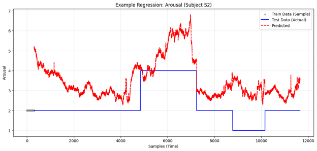
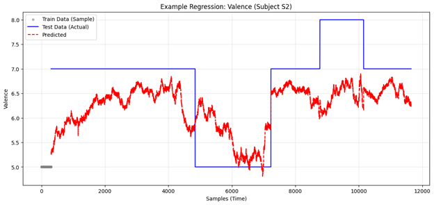
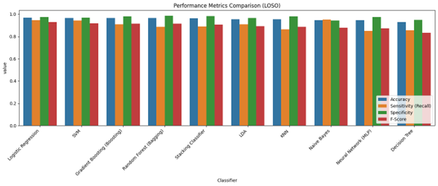

# Multimodal Stress & Affect Detection (WESAD)


A comprehensive machine learning project for stress and emotional detection using the **WESAD (Wearable Stress and Affect Detection)** dataset. This project validates the feasibility of using consumer-grade wearable sensors (Empatica E4) alongside medical-grade instrumentation (RespiBAN) to identify physiological markers of stress.

## 🚀 Project Highlights
* **High-Accuracy Classification:** Achieved **96.95% Accuracy** and an **0.93 F-Score** in binary stress detection (Stress vs. Baseline).
* **Robust Validation:** Implemented **Leave-One-Subject-Out (LOSO)** cross-validation to ensure the model generalizes to unseen individuals.
* **Complex Signal Processing:** Extracted 54 time and frequency-domain features from raw ECG, EDA, EMG, and Accelerometer signals.
* **Unsupervised Validation:** Confirmed physiological state distinctness with an **Adjusted Rand Index (ARI) of 0.80** using K-Means clustering.

---

## 🛠 Skills & Technologies
* **Signal Processing:** Welch’s Method (PSD), Butterworth Filters (Tonic/Phasic EDA separation), RMSSD (HRV) extraction.
* **Supervised Learning:** Logistic Regression, Random Forests, Gradient Boosting, SVM, MLP, and Stacking Ensembles.
* **Unsupervised Learning:** K-Means, Gaussian Mixture Models (GMM), PCA, and Elbow/Silhouette analysis.
* **Statistical Analysis:** Bidirectional Stepwise Selection, Multicollinearity (VIF) Analysis, OLS Regression, and Hypothesis Testing (p-values, F-statistics).
* **Data Engineering:** Subject-Specific Z-score Standardization, SMOTE (Imbalance Handling), and Isolation Forests (Anomaly Detection).
* **Tools:** `Python`, `Scikit-learn`, `Scipy`, `Statsmodels`, `Pandas`, `Numpy`, `Seaborn`.

---

## 🧬 Analytical Pipeline

### Phase I: Feature Engineering & Preprocessing
* **Signal Synchronization:** Aligned high-frequency data (700Hz Chest / 64Hz Wrist) into 60s/5s sliding windows.
* **Normalization:** Applied **Subject-Specific Standardization** to account for individual physiological baselines (e.g., resting heart rate variance).
* **Dimensionality Reduction:** Pruned 54 features down to the most predictive subset using a hybrid **Random Forest Importance + VIF** approach to eliminate multicollinearity.
* **Outlier Removal:** Used **Isolation Forest** (5% contamination) to clean motion artifacts.

### Phase II: Regression Analysis (Emotional Mapping from Survery)
* **Goal:** Predict continuous **Arousal** (Intensity) and **Valence** (Positivity).
* **Method:** OLS Multiple Linear Regression with **Bidirectional Stepwise Selection**.
* **Finding:** Physiological signals are strong predictors of Arousal ($R^2 \sim 0.50$) but weaker for Valence, reflecting the "internal" nature of physiological arousal.

#### Visualization Example:



### Phase III: Classification (Stressed or Not Stressed)
* **Models:** Evaluated 8+ algorithms including Naive Bayes, KNN, SVM, and Neural Networks.
* **Optimization:** Used `GridSearchCV` for hyperparameter tuning and `ImbPipeline` to apply **SMOTE** only within training folds (preventing data leakage).
* **Winner:** **Logistic Regression** outperformed complex ensembles, demonstrating that a well-regularized linear model is highly effective for standardized physiological data.

#### Visualization Example:



### Phase IV: Clustering (Unsupervised Validation)
* **Goal:** Verify if "Stress" and "Baseline" are naturally distinct physiological states without using labels.
* **Metric:** Optimized clusters ($k=2$) via **Silhouette Score** (0.384) and **Elbow Method**.
* **Result:** High alignment with ground truth (ARI = 0.80), validating the robustness of the derived features.

#### Visualization Example:


---

## 📊 Results Summary

| Metric | Regression (Arousal) | Classification (Stress) | Clustering (Unsupervised) |
| :--- | :--- | :--- | :--- |
| **Primary Metric** | $R^2 \approx 0.50$ | **96.95% Accuracy** | **0.80 ARI** |
| **Secondary Metric** | Significant F-stat ($p < 0.05$) | **0.93 F-Score** | 0.38 Silhouette Score |

**Top Predictors Identified:**
1. `Wrist_EDA_mean` (Most dominant predictor)
2. `Wrist_BVP_rate` (Heart rate variability)
3. `Chest_Temp_min` (Temperature variations)

---

## 📂 Repository Structure
* `Phase1_part1.py`: Data ingestion, unit conversion, and WESAD parsing.
* `Phase1_part2.py`: EDA, SMOTE, VIF filter, and RF feature selection.
* `Phase2.py`: Stepwise Regression and LOSO validation for affect prediction.
* `Phase3_loso.py`: Comprehensive classification suite with LOSO validation.
* `Phase4.py`: Unsupervised clustering (K-Means/GMM) and PCA visualization.
* `CS 5805 Final Report.pdf`: Detailed technical methodology and performance analysis.

---

## Usage

1. Clone the repository:
```sh
!git clone https://github.com/HemuTheReddy/Stress-Prediction
```
2. Install required libraries
```bash
pip install dash pandas numpy plotly scipy sklearn seaborn
```
3. Go to python folder
```bash
cd python
```
4. Run Phase 1
```bash
python Phase1_part1.py
```
5. Run Phase 1 part 2
```bash
python Phase1_part2.py
```
6. Run Phase 2
```bash
python Phase2.py
```
7. Run Phase 3
```bash
python Phase3_loso.py
```
8. Run Phase 4
```bash
python Phase4.py
```
---

## 🎓 Acknowledgments/Citation
Developed as the Final Term Project for **CS 5805: Machine Learning I** at **Virginia Tech**. 

Dataset source: https://archive.ics.uci.edu/dataset/465/wesad+wearable+stress+and+affect+detection

Paper used:
> Schmidt, P., Reiss, A., Duerichen, R., Marberger, C., & Van Laerhoven, K. (2018). Introducing WESAD: A Multimodal Dataset for Wearable Stress and Affect Detection. In *Proceedings of the 20th ACM International Conference on Multimodal Interaction* (pp. 400-408). ACM. https://doi.org/10.1145/3242969.3242985
